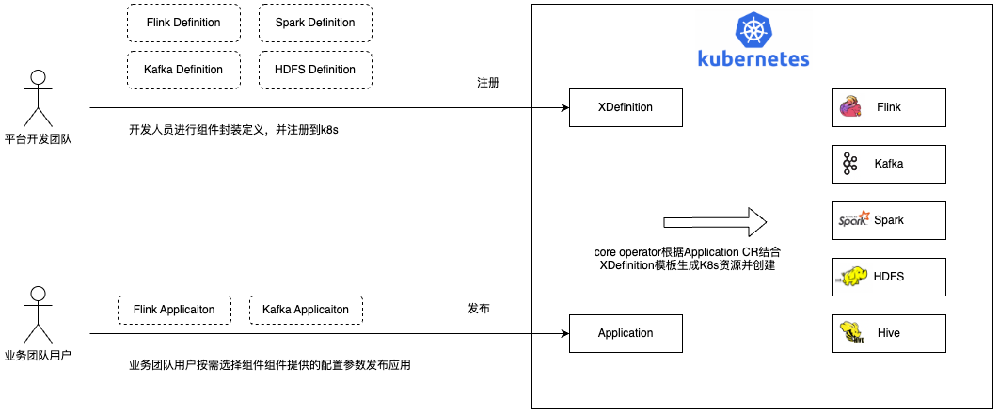
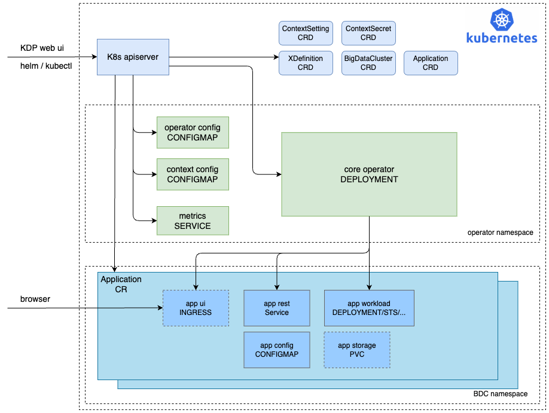

# 简介与基本使用
## Operator介绍
### 设计目标
kdp oam operator是基于KDP的顶层设计理念立足于大数据服务，进行云原生落地实现的关键组件。基于KDP大数据集群(BDC，bigdata cluster)设计为用户提供了基于OAM应用模型的应用管理能力，打造贴合企业大数据服务使用需求、开箱即用的应用交付模式。

kdp oam operator做到企业级大数据应用场景下的关注点分离，让平台团队关注基于应用云原生定义并处理好组件间依赖，让用户关注应用资源、配置屏蔽底层容器云环境的负责性降低用户使用门槛提高用户提要。基于这个理念kdp oam operator提供的一整套高度可扩展的应用构建与管理模型，平台开发者在了解kdp oam operator基本模型后可以非常容易的将自建应用或开源社区大数据服务纳入KDP管理实现大数据服务云原生化。

### 核心能力
1.k8s native

kdp oam operator是在KDP大数据顶层抽象模型指导下基于K8S进行落地的实现，通过operator标准能力扩展 Kubernetes API 为用户提供云原生环境下简单易用的K8S云原生大数据应用无需引入三方复杂依赖即可构建平台能力。

2.基于大数据集群的应用交付模式

通过大数据集群模型的隔离即能够简化面向应用交付过程又能根据业务需求提供资源隔离解决组件间依赖问题，同时满足平台构建者引入云下组件依赖的需求，让开发者自助式灵活的交付云原生应用。

3.关注点分离

为用户提供以应用为中心而不是以平台环境为中心的开销即用的应用服务，用户不再需要了解 Kubernetes 复杂概念与底层平台特性。平台团队可以将高可用、监控告警等能力直接在定义时进行封装提供更安全、稳定的应用服务。

4.应用组件高度可扩展

kdp oam operator实现提供可编程模型平台开发者可以通过 CUE 封装应用交付内容，最终用户无需关注应用资源复杂拓扑结构而是专注于组件资源需求定义和业务开发本身。

5.自定义应用UI

基于注释自动生成OpenAPI json schema与VJSF ui schema，为web ui提供组件差异化部署管理页面提供能力支撑。具体能力请见 自定义UI 章节。

### 工作流程
如下图所示，虚线框为资源定义与配置、实线框为在K8s上创建的资源。


应用创建分为3个步骤：
- 应用注册：由平台团队的应用开发工程师根据大数据应用最佳实践，将不同的大数据应用组件进行云原生封装。将封装的内容以XDefinition(CRD)资源形式注册到K8s。

- 应用发布：业务团队根据平台提供的应用类型与参数完成应用实例必要配置。

- 应用创建：由kdp oam operator根据用户定义Application配置结合平台定义XDefinition创建大数据应用。

由于应用的定义是由有经验的平台组件开发人员完成，可以预先集成一系列如监控、告警等能力为应用Day-2 operating提供基础构建起高质量的企业级应用组件。

### 部署bdc预备应用
在部署kdp oam operator后会将KDP默认提供的大数据应用XDefinition完成注册，使用时先创建大数据集群BDC然后创Application即可通过kdp oam operator能力完成应用发布。

创建bdc
```yaml
apiVersion: bdc.kdp.io/v1alpha1
kind: BigDataCluster
metadata:
  name: exp-exp
spec:
  disabled: false
  frozen: false
  namespaces:
    - isDefault: true
      name: exp
```
创建测试minio
```yaml

apiVersion: bdc.kdp.io/v1alpha1
kind: Application
metadata:
  annotations:
    bdc.kdp.io/name: exp-exp
    bdc.kdp.io/namespace: exp-exp
    bdc.kdp.io/org: exp
  name: exp-exp-minio
spec:
  name: minio
  type: minio
  properties:
    mode: standalone
    persistence:
      enabled: true
      size: 1Gi
    resources:
      limits:
        cpu: '1'
        memory: 4Gi
      requests:
        cpu: '0.1'
        memory: 128Mi
    auth:
      rootPassword: admin.password
      rootUser: admin.username
```

# 核心概念
## 系统架构
kdp oam operator通过项目提供的helm chart部署，会创建KDP大数据模型抽象的CRD、operator负载、operator关键配置，kdp oam operator部署后会将默认提供的大数据服务通过XDefinition进行注册。最终用户通过KDP web ui(高级用户可以通过kubectl命令行)创建Application CR，kdp oam operator通过监听application event结合XDefinition模板最终创建出大数据服务所需的各类资源工最终用户使用。


## 模型定义与实现
在KDP基于"大数据集群"管理的应用模型主要有以下几个重要的资源对象：XDefinition、BDC、Application、Contextsetting、ContextSecret。

### XDefinition
XDefinition是kdp oam operator最基础也是最重要的抽象，它提供通过模板定义资源结构与拓扑的能力。
XDefinition通过CUE配置语言来实现插件式可编程的资源抽象模型，它主要包括了元数据定义、资源类型声明、以及CUE输入、输出。一个简单的例子如下所示：
```yaml
apiVersion: bdc.kdp.io/v1alpha1
kind: XDefinition
metadata:
  annotations:
    definition.bdc.kdp.io/description: Init hdfs context setting resource
  name: ctx-setting-hdfs
spec:
  apiResource:
    definition:
      apiVersion: bdc.kdp.io/v1alpha1
      kind: ContextSetting
      type: hdfs
  schematic:
    cue:
      template: |
        output: {
          apiVersion: "v1"
          kind:       "ConfigMap"
          metadata: {
            name:      context.name
            namespace: context.namespace
            annotations: context.bdcAnnotations
          }
          data: {
            "core-site.xml": parameter.coreSite
            "hdfs-site.xml": parameter.hdfsSite
            "yarn-site.xml": parameter.yarnSite
            "webhdfs": parameter.webhdfs
            "ranger_repository_name": parameter.rangerServiceName
          }
        }
 
        parameter: {
          coreSite: string
          hdfsSite: string
          yarnSite: string
          webhdfs: string
          rangerServiceName: string
        }
```
以上示例的代码定义了一个资源类型为ContextSetting为HDFS服务的XDefinition模板。在cue template中指定输入为coreSite、hdfsSite等HDFS核心配置信息，输出为K8S原生资源对象Configmap并将输入的信息写入`data`对应字段中。

### BDC(big data cluster)
KDP在K8s命名空间之上构建了BDC大数据集群（一个或多个命名空间）的模型，为用户提供了租户粒度下多套大数据集群（例如测试集群、生产集群）管理的能力。同时，通过KDP的多租户体系，多大数据集群之间能够灵活按需地配置租户内和租户间的资源，解决了K8s资源隔离模型单一、不够灵活的问题，避免了由于不同业务组件相互干扰的情况。
BDC的XDefinition模板已由kdp oam operator定义。cue template指定输入为一个namespace列表和frozen、disabled两个可选配置（KDP通过平台能力进行BDC资源管理，frozen将不再允许新发布Application，disabled将禁用BDC），输出为K8S原生资源对象Namespace。
由于设计上一个BDC可以管理多个Namespace，所以实现时需要将它定义为k8s cluster scope的资源。后续将要介绍的Application、ContextSetting、ContextSecret都基于BDC粒度来进行管理，允许创建在指定BDC的不同Namespace下，所以它们也是k8s cluster scope的资源。

```yaml
apiVersion: bdc.kdp.io/v1alpha1
kind: XDefinition
metadata:
  annotations:
    definition.bdc.kdp.io/description: Init namespace for bigdatacluster instance
  name: bigdatacluster-def
spec:
  apiResource:
    definition:
      apiVersion: bdc.kdp.io/v1alpha1
      kind: BigDataCluster
  schematic:
    cue:
      template: |
        output: {
        	apiVersion: "v1"
        	kind:       "Namespace"
        	metadata: {
        		name: parameter.namespaces[0].name
        		annotations: context.bdcAnnotations
                labels: context.bdcLabels
        	}
        }
        outputs: {
        	for i, v in parameter.namespaces {
        		if i > 0 {
        			"objects-\(i)": {
        				apiVersion: "v1"
        				kind:       "Namespace"
        				metadata: {
        					name: v.name
        					annotations: "bdc.kdp.io/name": context.bdcName
        				}
        			}
        		}
        	}
        }

        parameter: {
        	frozen?:   *false | bool
        	disabled?: *false | bool
        	namespaces: [...{
        		name:      string
        		isDefault: bool
        	},
        	]
        }
```
需要创建新的bdc，只需要发布一个的bdc CR即可，示例如下。
```yaml
apiVersion: bdc.kdp.io/v1alpha1
kind: BigDataCluster
metadata:
  name: test
  labels:
    "foo": "bar"
  annotations:
    "bdc.kdp.io/org": "test-test"
    "bdc.kdp.io/name": "test"  
spec:
  namespaces:
  - name: test                # 指定namespace的名称(由客户端按照一定规则生成)；实现context机制(使用context.name),为底层资源注入labels annotations等信息
    isDefault: true           # 标识namespace是否默认的，namespaces列表中只有一个default
```
### Application
KDP Application设计最核心的目标是封装应用本身的复杂性，将应用功能直观呈现给最终用户。所以与OAM模型中的Application定义不同，KDP kdp oam operator设计的Application更为直接。

在大数据应用生态下一些组件已经有开源社区实现了K8S云原生operator，通过OAM模型并不能很好的将基于K8S CRD云原生的大数据应用能力以开箱即用的方式提供给用户依旧需要用户了解应用的CRD结构才能很好的使用。KDP定义了一个非常灵活扩展性极强的Application模型，不限制Application的形式而是提供基于CUE template封装复杂应用结构只暴露出最关键的配置或开关。KDP Application既可以使用OAM模型，也可以直接生成资源对象CR，或是集成fluxcd发布基于helm构建的应用。不论用户当前应用以何种形式进行云原生落地都可以顺利接入KDP Application模型中管理。

Application具体实现也基于XDefinition的模版，它定义同类型应用标准的交付信息。这使得最终用户无需关注底层细节，就可以使用平台定义好的丰富能力，并基于统一的概念自助式操作。另外，为了更好的提供web ui操作支持，KDP还为Application提供了基于注释生成OpenAPI json Schema与VJSF ui schema的能力，详情请参考自定义组件部署UI。

不同的应用在云原生下拓扑结构与基础负载不尽相同，kdp oam operator提供了大数据场景下最为常用组件的最佳实践若需要进行自定义应用扩展，请查考3.1自定义应用扩展。在具体项目实践的过程中我们发现将KDP Application与OAM结合使用会有1+1>2的效果，通过KDP Application封装应用本身的复杂功能结合OAM的模型定义实现统一标准企业级的应用模型构建。以下是KDP提供的minio应用对应XDefinition，它通过KDP Application封装了复杂了OAM Application为最终用户屏蔽了OAM模型结构提供最直观的资源配置参数与能力开关，降了了最终用户的使用门槛。

以下是一个minio的XDefinition模版定义，其中`spec.apiResource.definition.kind`指定了模板类型为Application，`spec.apiResource.definition.type`指定了Application的类型是minio
```yaml
apiVersion: bdc.kdp.io/v1alpha1
kind: XDefinition
metadata:
  name: application-minio
spec:
  apiResource:
    definition:
      apiVersion: bdc.kdp.io/v1alpha1
      kind: Application
      type: minio
  schematic:
    cue:
      template: {
        output: {
          apiVersion: "core.oam.dev/v1beta1",
          kind: "Application",
          metadata: {
            name: context[ "name" ],
            namespace: context[ "namespace" ]
          },
          spec: {
            components: [
              {
                name: context[ "name" ],
                properties: {
                  chart: "minio",
                  releaseName: context[ "name" ],
                  repoType: "helm",
                  targetNamespace: context[ "namespace" ],
                  url: context[ "helm_repo_url" ],
                  values: { ... },
                  version: "11.10.2"
                },
                traits: [ ... ],
                type: "helm"
              }
            ],
            policies: [ ... ]
          }
        }
        parameter: {
          mode: "distributed" | "standalone"
          persistence: {
            enabled: *true | bool
            size: *"1Gi" | string
          }
          statefulset: {
            replicaCount: *4 | int
            zones: *1 | int
          }
          resources: {
            requests: {
              cpu: *"0.1" | string
              memory: *"128Mi" | string
            }
            limits: {
              cpu: *"1" | string
              memory: *"4Gi" | string
            }
          }
          affinity?: {}
          auth: {
            rootUser: *"admin" | string
            rootPassword: *"admin.password" | string
          }
        }
      }
```

minio发布时最终用户只需要创建以下Application CR即可，在具体实现上Application通过meta.annotations来传递bdc信息并指定安装到bdc下的不同Namespace。CR中`spec.type`声明了Application type为minio，需要kdp oam operator根据对应XDefinition模板生成应用。
```yaml
apiVersion: bdc.kdp.io/v1alpha1
kind: Application
metadata:
  annotations:
    bdc.kdp.io/name: exp-exp
    bdc.kdp.io/namespace: exp-exp-beda998c
  name: c22-34-minio
spec:
  name: minio
  properties:
    auth:
      rootPassword: admin.password
      rootUser: admin
    mode: distributed
    persistence:
      enabled: true
      size: 1Gi
    resources:
      limits:
        cpu: '1'
        memory: 4Gi
      requests:
        cpu: '0.1'
        memory: 128Mi
    statefulset:
      replicaCount: 4
      zones: 1
  type: minio
```

### ContextSetting
ContextSetting是为了处理组件间依赖而设计的资源模型，因为在OLAP场景下组件间的依赖信息相较于OLTP场景应用更为复杂。比如Hive部署需要HDFS core-site.xml、hdfs-site.xml等配置，这就需要HDFS应用发布时提供上下文配置供下游组件使用。ContextSetting本身是与平台无关可以有多种落地实现形式的资源模型，目前KDP的默认是基于K8S ConfigMap实现，在K8S云原生环境下下游组件工作负载可以直接挂载使用不需要平台上层应用额外处理。由于不同应用所提供的上下文信息不同，需要根据应用情况进行定义。比如HDFS在提供的contextsetting中提供core-site.xml、hdfs-site.xml配置，zookeeper则提供地址端口信息即可。

在XDefinition介绍时，已经示例过HDFS的ContextSetting XDefinition定义，下面以zookeeper为例来看一个简单组件的ContextSetting XDefinition定义与ContextSetting CR发布。

Zookeeper Contextsetting XDefinition定义：以下示例的代码定义了一个zookeeper ContextSetting的XDefinition模板。在cue template中指定输入为host、hostname、port核心配置信息，输出为K8S原生资源对象Configmap并将输入的信息写入`data`对应字段中。
```yaml
apiVersion: bdc.kdp.io/v1alpha1
kind: XDefinition
metadata:
  annotations:
    definition.bdc.kdp.io/description: Zookeeper context setting resource
  name: ctx-setting-zookeeper
spec:
  apiResource:
    definition:
      apiVersion: bdc.kdp.io/v1alpha1
      kind: ContextSetting
      type: zookeeper
  schematic:
    cue:
      template: |
        output: {
          apiVersion: "v1"
          kind: "ConfigMap"
          metadata: {
            name: context.name
            namespace: context.namespace
            annotations: context.bdcAnnotations
          }
          data: {
            "host": parameter.host
            "hostname": parameter.hostname
            "port": parameter.port
          }
        }
        parameter: {
          host: string
          hostname: string
          port: string
        }
```
与Application类似KDP下基于XDefinition构建实现大数据集群管理的资源都是通过meta.annotations来传递bdc信息并指定安装到bdc下的不同Namespace。
```yaml
apiVersion: bdc.kdp.io/v1alpha1
kind: ContextSetting
metadata:
  annotations:
    bdc.kdp.io/name: exp-exp
    bdc.kdp.io/namespace: exp-exp
  name: exp-exp-zookeeper
spec:
  name: zookeeper-context
  properties:
    host: zookeeper.exp.svc.cluster.local:2181
    hostname: zookeeper.exp.svc.cluster.local
    port: '2181'
  type: zookeeper
```

### ContextSecret
ContextSecret是对ContextSetting的一个补充，因为一些应用提供的上下文是安全敏感信息（比如账号密码），这类信息不适合直接明文存储。ContextSecret就是为这类信息而设计的，目前ContextSecret默认基于K8s secret实现，下游应用可以直接挂载使用。

以下是KDP为MySQL提供ContextSecret XDefinition模版定义。
```yaml
apiVersion: bdc.kdp.io/v1alpha1
kind: XDefinition
metadata:
  annotations:
    definition.bdc.kdp.io/description: Init context secret resource
  name: ctx-secret-mysql
spec:
  apiResource:
    definition:
      apiVersion: bdc.kdp.io/v1alpha1
      kind: ContextSecret
      type: mysql
  schematic:
    cue:
      template: |
        output: {
        	apiVersion: "v1"
        	kind:       "Secret"
        	metadata: {
        		name:      context.name
        		namespace: context.namespace
                annotations: context.bdcAnnotations
        	}
        	type: "Opaque"
        	data: {
              MYSQL_USER: parameter.MYSQL_USER
              MYSQL_PASSWORD: parameter.MYSQL_PASSWORD
            }
        }

        parameter: {
          // +ui:description=设置mysql的用户名
          MYSQL_USER: string
          // +ui:description=设置mysql的密码
          MYSQL_PASSWORD: string
        }
```
客户使用时只需要创建ContextSecret CR，示例如下。
```yaml
apiVersion: bdc.kdp.io/v1alpha1
kind: ContextSecret
metadata:
  annotations:
    bdc.kdp.io/name: exp-exp
    bdc.kdp.io/namespace: exp
  name: exp-exp-mysql-secret
spec:
  name: mysql-secret
  properties:
    MYSQL_PASSWORD: YWxrY3UpI2NhR0MiY3o=
    MYSQL_USER: a2RwYmlnZGF0YXVzZXI=
  type: mysql
```

# 用户手册
## 自定义应用扩展
### 环境配置
平台配置会随着环境不同而有所区别，在KDP应用模型定义的XDefinition模版通过cue context来解决环境问题保证应用模型一次构建处处运行。

平台用户若想扩展自定义应用组件除kdp oam operator默认提供的cue context外可以自定义扩展应用所需环境变量context。只需要在kdp oam operator部署时修改helm `values.yaml`的`bpaasContext` key-value内容即可。kdp oam operator部署时会生成Configmap存储用户自定义环境变量信息，自动补充到XDefinition的cue context中。

### 组件XDefinition扩展
自定义应用需要平台开发定义应用的XDefinition模版，然后注册到k8s。output中既可以是CR，也可以是fluxcd helm release，还可以是OAM模型应用。XDefinition模板的灵活度很高，可以由用户根据所需进行定义。
```yaml
apiVersion: bdc.kdp.io/v1alpha1
kind: XDefinition
metadata:
  name: application-name
spec:
  apiResource:
    definition:
      apiVersion: bdc.kdp.io/v1alpha1
      kind: Application
      type: [应用type]
  schematic:
    cue:
      template: {
        output: {
          // 用户自定义应用CR
        }
        outputs: {
          // 应用伴生资源
        }
        parameter: {
          //提供给最终用户的配置参数，可以定义默认值
        }
```

### 组件间依赖管理
在K8S上由于资源都是声明式定义很难做到依赖配置的自动装配，如果将依赖固定又会导致组件间紧耦合难以灵活部署管理。kdp oam operator结合KDP平台整体能力提供依赖类型配置声明，将依赖配置的选择在部署使用时声明。在Application的XDefinition模板定义结合parameter定义依赖的内容即可。

kdp oam operator在XDefinition中额外引入了`spec.dynamicParameterMeta[]`来声明组件间依赖供上层平台系统使用。其中`name`与cue template parameter中参数对应，`refType`是依赖组件的类型(目前只能依赖KDP Application)对应是依赖组件XDefinition模板定义中的`spec.apiResource.definition.type`，`refKey`表示依赖上游组件提供配置列表中的指定部分,如果为空则表示准备依赖全部。
```yaml
apiVersion: bdc.kdp.io/v1alpha1
kind: XDefinition
metadata:
  name: application-hbase
spec:
  apiResource:
    definition:
      apiVersion: bdc.kdp.io/v1alpha1
      kind: Application
      type: hbase
  dynamicParameterMeta:
    - description: hdfs config context name
      name: dependencies.hdfs.config           # 对应spec.cue.template.paramter参数
      refKey: ''                               # 为空拿表示需要直接作为文件挂载，不为空时依赖配置文件中的指定key
      refType: hdfs                            # 依赖组件类型，对应是依赖组件XDefinition模板定义中的spec.apiResource.definition.type
      required: true
      type: ContextSetting                     # 上下文类型，比如KDP抽象封装的ContextSetting、ContextSecret。也可以直接使用K8S ConfigMap/Secret
    - description: zookeeper quorum list
      name: dependencies.zookeeper.quorum
      refKey: hostname
      refType: zookeeper
      required: true
      type: ContextSetting
    - description: zookeeper port
      name: dependencies.zookeeper.port
      refKey: port
      refType: zookeeper
      required: true
      type: ContextSetting
  schematic:
    cue:
      template: ...
```

### 自定义UI
当前openapi jsonSchema会由operator根据XDefinition定义的cue template生成，ui-schema也会给予cue template基于注释字段添加方式实现。
#### 实现原则
- 通过注释的前缀tag来分辨配置情况，格式为`+xxxxx=`
- tag分为作用到OpenAPI schema、ui-schema两个（后续考虑扩展error-schema）
  - 作用于OpenAPI schema的注释：前缀与openapi schema struct中字段名称相同
    - 目前仅支持+description=、+title=、+minimum=、+maximum=、+minLength=、+maxLength=、+pattern=
  - 作用于ui-schema的注释：前缀按`+ui:xxxx=`格式处理，具体请见https://vue-json-schema-form.lljj.me/zh/guide/basic-config.html#ui-schema
    - 目前支持`+ui:order=`、`+ui:title=`、`+ui:hidden=`、`+ui:description=`、`+ui:options=`
  - 前缀按`+err:xxxx=`格式处理，具体请见https://vue-json-schema-form.lljj.me/zh/guide/basic-config.html#ui-schema
    目前仅支持`+err:options=`
    当前KDP组件开发时：

#### 使用说明
必须配置
- `+ui:description=`或`+description=`说明字段含义

建议配置
- `+ui:order=`控制field展示顺序
- `+minimum=`、`+maximum=`控制number最大、最小值
- `+pattern=` 控制string校验规则

| 注释头           | 效果             | 作用对象  | demo                                                                                                                                                          |
| :--------------- | :--------------- | :-------- |:--------------------------------------------------------------------------------------------------------------------------------------------------------------|
| +ui:title=       | ui展示时的字段   | ui-schema | // +ui:title=示例title 默认使用parameter field字段名称，添加该字段前端展示时使用配置title。                                                                                             |
| +ui:order=       | 字段排序         | ui-schema | // +ui:order=1 在同level字段排序顺序为1，如果有同order的字段会默认再按字母顺序二次排序。每个level都需要从头开始配置.如果不配level会在所有配置了level的字段之后以字母顺序排列                                                   |
| +ui:options=     | ui展示控制       | ui-schema | // +ui:options={"placeholder":"请输入kafka镜像","type":"textarea","rows":2} 控制ui展示形式，具体请见https://vue-json-schema-form.lljj.me/zh/guide/basic-config.html#ui-schema |
| +ui:hidden=      | 是否需要在ui展示 | ui-schema | // +ui:hidden=true 默认为false，如果不需要隐藏可以不加该配置                                                                                                                    |
| +ui:description= | 字段说明         | ui-schema | // +ui:description=kafka镜像 description描述信息，会覆盖schema description描述信息                                                                                          |
| +title=     | JsonSchema title | OpenAPI Schema | // +title=示例title 若配置`+ui:title=`会覆盖该配置效果                                                                                                                     |
| +minimum=   | number最小值限制 | OpenAPI Schema |                                                                                                                                                               |
| +maximum=   | number最大值限制 | OpenAPI Schema |                                                                                                                                                               |
| +minLength= | string最短校验   | OpenAPI Schema |                                                                                                                                                               |
| +maxLength= | string最长校验   | OpenAPI Schema |                                                                                                                                                               |
| +pattern=   | string正则校验   | OpenAPI Schema |                                                                                                                                                               |
```cue
parameter: {
  // +ui:description=kafka manager镜像
  // +ui:order=1
  image: *"kafka-manager:4.3.231221" | string
  // +ui:description=kafka manager实例数
  // +ui:order=2
  replicas: *1 | int
  // +ui:description=资源配置
  // +ui:order=3
  resources: {
    // +ui:description=资源上限
    // +ui:order=1
    limits: {
      // +ui:order=1
      cpu:  *"1" | string,
      // +ui:order=2
      memory: *"1024Mi" | string
    },
    // +ui:description=资源预留
    // +ui:order=2
    requests: {
      // +ui:order=1
      cpu: *"0.1" | string,
      // +ui:order=2
      memory: *"1024Mi" | string
   }
  }
  // +ui:description=kafka manager依赖的mysql配置
  // +ui:order=4
  mysql: {
    // +ui:description=kafka manager依赖的mysql地址端口配置
    // +ui:order=1
    // +err:options={"required":"请先安装mysql"}
    settingName: *"mysql-setting" | string
    // +ui:description=kafka manager依赖的mysql用户密码
    // +ui:order=2
    // +err:options={"required":"请先安装mysql"}
    secretName: *"mysql-secret" | string
  }
  // +ui:description=kafka manager依赖的kafka集群配置
  // +ui:order=5
  // +err:options={"required":"请先安装kafka"}
  kafkaCluster: string
  // +ui:description=kafka manager依赖的kafka connect配置
  // +ui:order=6
  connect?: string
  // +ui:description=kafka manager依赖的schema registry配置
  // +ui:order=7
  schemaRegistry?: string
}
```